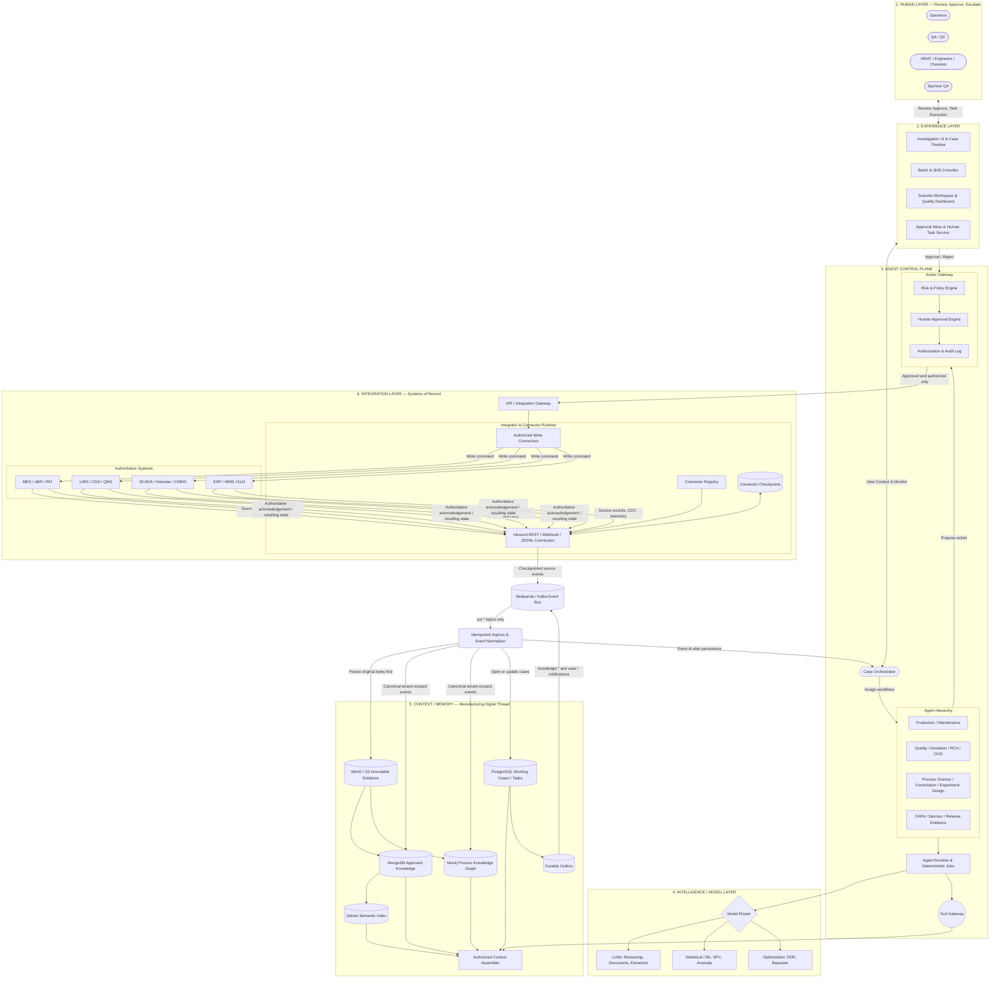

# Application architecture

The feedback loop deliberately returns through the authoritative system. A
proposed action does not update knowledge directly. After approval, the write
connector sends it to the applicable system of record; that system's generated
acknowledgement or resulting state is then collected by the inbound connector,
stored as immutable evidence, normalized, and projected into the knowledge base.

Connector checkpoints are committed only after a complete page reaches evidence
storage and all knowledge projections. Reprocessing before checkpoint commit is
safe because evidence ids, event ids, graph projections, documents, and outbox
messages are idempotent.

`ConnectorRunner.run_forever` supplies the continuous update loop. Each connector
is isolated so an unavailable historian, for example, does not prevent MES, LIMS,
or QMS from advancing their own checkpoints. Webhook connectors use the same
gateway immediately, while REST and export connectors are normally polled.

The Human and Experience layers are implemented by the operations API and static
responsive UI. The Case Orchestrator, Model Router, and Tool Executor remain
explicit unconfigured ports so the agent, harness, and tools can be added without
changing the approved human-control or data contracts.
