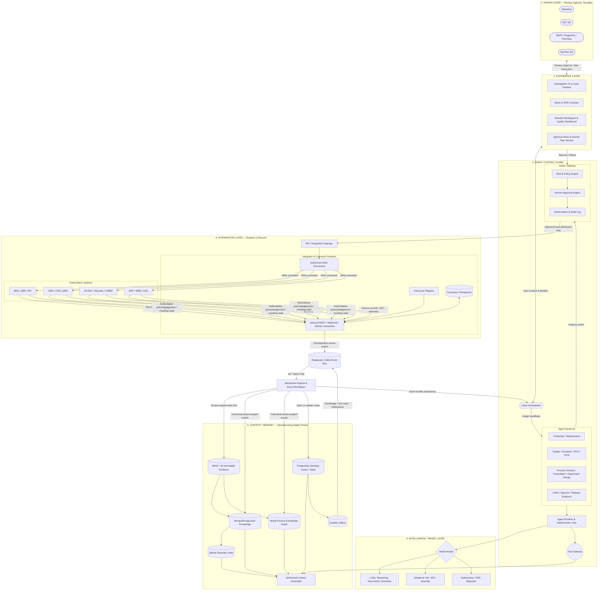

# Application architecture

```mermaid
flowchart TD
    subgraph L1["1. HUMAN LAYER — Review, Approve, Escalate"]
        direction LR
        Operators([Operators])
        QAQC([QA / QC])
        MSAT([MSAT / Engineers / Chemists])
        Sponsor([Sponsor QA])
    end

    subgraph L2["2. EXPERIENCE LAYER"]
        direction LR
        UI1[Investigation UI & Case Timeline]
        UI2[Batch & Shift Consoles]
        UI3[Scientist Workspace & Quality Dashboard]
        UI4[Approval Inbox & Human Task Service]
    end

    subgraph L3["3. AGENT CONTROL PLANE"]
        Orchestrator{{Case Orchestrator}}
        subgraph Agents[Agent Hierarchy]
            direction LR
            Prod[Production / Maintenance]
            Qual[Quality / Deviation / RCA / OOS]
            Sci[Process Science / Formulation / Experiment Design]
            Cross[CAPA / Sponsor / Release Evidence]
        end
        Runtime[Agent Runtime & Deterministic Jobs]
        ToolGate((Tool Gateway))
        subgraph Actions[Action Gateway]
            direction TB
            RiskPolicy[Risk & Policy Engine]
            HumanApproval[Human Approval Engine]
            AuthAudit[Authorization & Audit Log]
            RiskPolicy --> HumanApproval --> AuthAudit
        end
    end

    subgraph L4["4. INTELLIGENCE / MODEL LAYER"]
        direction LR
        Router{Model Router}
        LLM[LLMs: Reasoning, Documents, Extraction]
        ML[Statistical / ML: SPC, Anomaly]
        Opt[Optimization: DOE, Bayesian]
    end

    subgraph L5["5. CONTEXT / MEMORY — Manufacturing Digital Thread"]
        direction LR
        Evidence[(MinIO / S3 Immutable Evidence)]
        Docs[(MongoDB Approved Knowledge)]
        Graph[(Neo4j Process Knowledge Graph)]
        Cases[(PostgreSQL Working Cases / Tasks)]
        Vector[(Qdrant Semantic Index)]
        Context[Authorized Context Assembler]
        Outbox[(Durable Outbox)]
        Evidence --> Docs & Graph
        Docs --> Vector
        Docs & Graph & Cases & Vector --> Context
        Cases --> Outbox
    end

    subgraph L6["6. INTEGRATION LAYER — Systems of Record"]
        direction TB
        subgraph Integrator[Integrator & Connector Runtime]
            direction LR
            Catalog[Connector Registry]
            Inbound[Inbound REST / Webhook / JSONL Connectors]
            Checkpoints[(Connector Checkpoints)]
            WriteConnectors[Authorized Write Connectors]
            Catalog --> Inbound
            Checkpoints <--> Inbound
        end
        subgraph SOR[Authoritative Systems]
            direction LR
            SysMfg[MES / eBR / PAT]
            SysLab[LIMS / CDS / QMS]
            SysEquip[SCADA / Historian / CMMS]
            SysBiz[ERP / WMS / ELN]
        end
        API[API / Integration Gateway]
    end

    EventBus[(Redpanda / Kafka Event Bus)]
    Inbox[Idempotent Ingress & Event Normalizer]

    L1 <-->|Review, Approve, Task Execution| L2
    L2 <-->|View Context & Monitor| Orchestrator
    L2 -->|Approve / Reject| Actions

    SysMfg & SysLab & SysEquip & SysBiz -->|Source records, CDC, telemetry| Inbound
    Inbound -->|Checkpointed source events| EventBus
    EventBus -->|sor.* topics only| Inbox
    Inbox -->|Persist original bytes first| Evidence
    Inbox -->|Canonical tenant-scoped events| Docs & Graph
    Inbox -->|Open or update cases| Cases
    Inbox -->|Event id after persistence| Orchestrator

    Orchestrator -->|Assign workflows| Agents
    Agents --> Runtime
    Runtime --> Router
    Router --> LLM & ML & Opt
    Runtime --> ToolGate
    ToolGate --> Context

    Agents -->|Propose action| Actions
    Actions -->|Approved and authorized only| API
    API --> WriteConnectors
    WriteConnectors -->|Write command| SysMfg & SysLab & SysEquip & SysBiz

    SysMfg & SysLab & SysEquip & SysBiz -->|Authoritative acknowledgement / resulting state| Inbound
    Outbox -->|knowledge.* and case.* notifications| EventBus
```

The feedback loop deliberately returns through the authoritative system. A
proposed action does not update knowledge directly. After approval, the write
connector sends it to the applicable system of record; that system's generated
acknowledgement or resulting state is then collected by the inbound connector,
stored as immutable evidence, normalized, and projected into the knowledge base.

Connector checkpoints are committed only after a complete page reaches evidence
storage and all knowledge projections. Reprocessing before checkpoint commit is
safe because evidence ids, event ids, graph projections, documents, and outbox
messages are idempotent.

`ConnectorRunner.run_forever` supplies the continuous update loop. Each connector
is isolated so an unavailable historian, for example, does not prevent MES, LIMS,
or QMS from advancing their own checkpoints. Webhook connectors use the same
gateway immediately, while REST and export connectors are normally polled.

The operations application now supplies a first HTTP implementation of this path
through `ConnectorMonitor`. Administrators configure it in the Source Connectors
workspace. It persists cursors and source-record deduplication, writes each record
through `DigitalThread.ingest_raw_event`, opens a deterministic deviation case for
configured event types, and can invoke the Prime Agent case orchestrator. The
file-backed monitor is intended for a single application worker; shared connector
leases remain required for horizontally scaled deployment.

The Human and Experience layers are implemented by the operations API and responsive
UI. Tenant and site scope is applied to case, task, action, connector, audit, agent-run,
and context reads as well as writes. The development identity headers are not an
authentication mechanism; production deployments must replace them with trusted
OIDC/JWT claims at the gateway.

## Base implementation map

| Architecture component | Base implementation |
|---|---|
| Case orchestrator | `CaseOrchestrator` selects a specialist from the case type and exposes one run contract. |
| Persistent operating agents | Dynamic campaign-recovery, QC-flow, maintenance, materials, quality, capacity, science, and CAPA/release specialists; Prime deviation and deterministic fallback remain available. |
| Dynamic agent runtime | Provider-neutral command or HTTP reasoning adapter, tenant-keyed persisted runs, bounded tool rounds, structured findings/gaps/tasks/proposals, and explicit recommend-only authority. |
| Decision engine and jobs | SPC, anomaly detection, DOE, recovery-plan ranking, scenario projection, and economic-impact calculation behind an allow-listed gateway. |
| Model router | `DeterministicModelRouter` supplies inspectable computation while configured dynamic/Prime capacity is reported separately and honestly. |
| Tool gateway | `ToolGateway` allow-lists `spc`, `anomaly`, `doe`, `recovery_plan`, `scenario`, and `impact`; manufacturing retrieval remains separately allow-listed by concept. |
| Action gateway | Risk classification, separation-of-duties approvals, site authorization, audit, and execute-after-approval only. |
| Context and memory | Immutable evidence, approved documents, process graph, working cases/tasks, semantic extension, and outbox. |
| Integration | Checkpointed connectors, event normalization, monitored HTTP sources, and authoritative acknowledgement ingestion. |
| Learning loop | Authorized actual-outcome capture persists projected-versus-actual metrics for value attribution, calibration, and performance monitoring. |

When no dynamic provider is configured, non-deviation specialists intentionally use
the deterministic fallback rather than pretending that a reasoning model is present.
The dynamic runtime is provider-neutral and receives the routed specialist definition,
authorized context envelope, tool catalog, and strict output contract on every run.
This lets a reviewed command or HTTP adapter replace the fallback without changing UI,
API, tenancy, action-control, or audit contracts.

Development action execution returns a clearly identified `DEMO-ACK-*` receipt and
ingests that acknowledgement through the digital thread so the entire feedback loop
is demonstrable. Production discovers the MES/QMS/LIMS/CMMS/ERP connector catalog and
enables execution only when at least one connector has a write path. Proposals must
name `payload.source_system`; missing or read-only connectors fail closed. Knowledge
changes only after a source-system acknowledgement
is ingested; an action proposal or approval never edits manufacturing truth directly.
