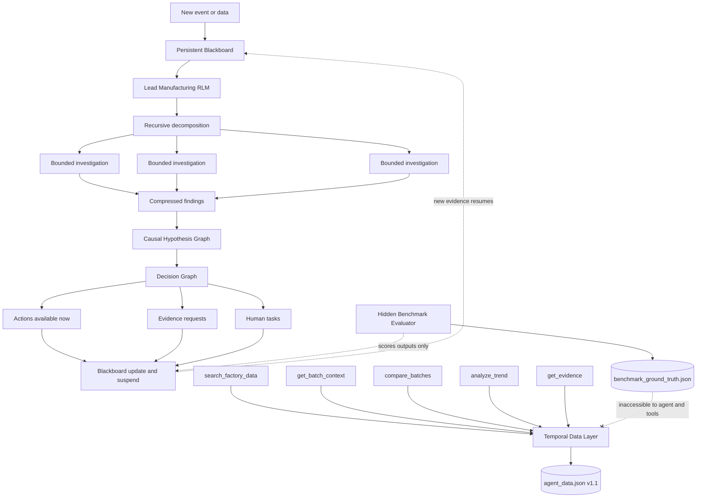

# Manufacturing OS RLM architecture

## System boundary

The v1.1 Manufacturing OS is a bounded investigation and coordination system. It accelerates work that can be performed from existing factory data while explicitly representing laboratory, inspection, human-observation, and external evidence that does not yet exist. It never substitutes software inference for missing physical evidence or authorized GMP decisions.



The seven tools use the same temporal session. Retrieval tools sit above the Temporal Data Layer; `request_new_evidence` and `create_investigation_task` write structured Blackboard proposals but cannot manufacture results or execute regulated actions.

## Rollout lifecycle

```text
OBSERVE
→ LOAD THE EXISTING BLACKBOARD
→ DECOMPOSE INTO BOUNDED QUESTIONS
→ RUN INDEPENDENT QUESTIONS IN PARALLEL
→ SYNTHESIZE COMPACT FINDINGS
→ UPDATE THE CAUSAL HYPOTHESIS GRAPH
→ UPDATE THE DECISION GRAPH
→ COMPLETE AVAILABLE DIGITAL WORK
→ REQUEST MISSING PHYSICAL EVIDENCE / PROPOSE HUMAN TASKS
→ PERSIST STRUCTURED STATE
→ SUSPEND
```

New evidence resumes the same incident Blackboard. The runtime does not replay a conversation transcript and does not persist private reasoning. A rollout is bounded by recursion depth, concurrent subtasks, and total tool calls.

## Architectural decisions

### Lead RLM

The Lead RLM allows dynamic problem decomposition for manufacturing failures that were not predefined. It receives the problem, structured Blackboard, new evidence, and tool descriptions, then converts the problem into bounded questions. Only the Lead owns incident-wide synthesis and graphs; workers cannot establish durable independent worldviews.

### Persistent Blackboard

The Blackboard maintains long-running investigation state without replaying large conversational histories. It persists only structured observations, scope, resolved and open questions, pending evidence, completed investigations, actions, graph nodes, teams, evidence IDs, and rollout measurements. Atomic JSON writes make suspension and resumption explicit and testable.

### Causal Hypothesis Graph

Manufacturing failures are causal and ambiguous. The graph preserves competing explanations, causal parent/child paths, supporting evidence, contradicting evidence, discriminating observations, and explicit unknowns rather than collapsing the investigation into one generated answer. Confidence is evidential belief and is independent of consequence severity.

### Decision Graph

The Decision Graph prepares actions before slow physical evidence arrives. It separates “what might be happening?” from “what should we do now?” Each node includes its condition, true and false branches, work available immediately, and evidence dependencies. This supports prebuilt response branches without pretending to know future test results.

### Parallel bounded investigations

Independent questions run concurrently to collapse human sequential investigation latency while recursion depth and tool budgets limit token and compute use. Workers return only compact findings, citations, counterevidence, and uncertainties. They are temporary tasks, not role-playing permanent agents.

### Generic factory search

`search_factory_data` provides an open-ended investigation primitive instead of encoding every failure mode. It can explore unfamiliar equipment, yield, pressure, cycle-time, environmental, operator, process, and quality signals across permitted systems.

### Batch context

`get_batch_context` avoids repeated retrieval of commonly required batch-linked records. It returns a compact view organized by source while retaining source evidence IDs.

### Batch comparison

`compare_batches` supports cross-batch reasoning, which is central to recurrence and systemic-condition assessment. It performs data reduction and descriptive computation but does not label a pattern causal.

### Trend analysis

`analyze_trend` moves deterministic calculations outside the language model. Counts, summary statistics, slope, threshold proximity, and historical deltas are reproducible and evidence-linked.

### Evidence retrieval

`get_evidence` keeps conclusions auditable. Unknown, unauthorized, and not-yet-available record IDs return no source record.

### Request new evidence

`request_new_evidence` models what software cannot know until a human or physical process produces new information. It creates a dependency with no answer and distinguishes tests from human observations.

### Task creation

`create_investigation_task` turns investigation into coordinated operational work. Tasks are proposed for QA, Microbiology, MSAT, Manufacturing, or Maintenance and remain behind the human authorization boundary.

### Temporal Data Layer

The temporal layer guarantees historical replay integrity and prevents hindsight leakage. Every record has:

- `occurred_at`: when the physical or business event happened;
- `available_at`: when the Manufacturing OS could first know the record;
- `field_available_at`: when late-populated fields could first be known; and
- `availability_type`: existing record, new test, human observation, or external signal.

Every tool enforces `available_at <= as_of` and removes fields whose individual availability is later than `as_of`. Benchmark modes change only table permissions; the RLM, prompt, rollout, and tool implementations remain identical.

### Hidden evaluator

The evaluator enables objective scoring without giving the agent the answer. Ground-truth labels, final outcomes, public-lot mapping, generation reasons, and precursor scoring windows reside in a physically separate file. The runtime store accepts only `agent_data.json`; the benchmark invokes a leakage audit before constructing an agent or reporting results.

## Benchmark modes

| Mode | Available context |
|---|---|
| `current_event_only` | The triggering evidence record only |
| `lims_only` | Time-valid batch and LIMS evidence |
| `lims_qms` | Time-valid batch, LIMS, and QMS evidence |
| `full_os` | All time-valid factory systems |

This isolates information access from agent behavior. The same Lead RLM, decomposition rules, workers, graphs, and system specification run in all four modes.

## Authorization and execution

The RLM may search, compare, calculate, generate and challenge hypotheses, request evidence, propose escalation, and create reviewable tasks. It cannot release or reject batches, close deviations, approve CAPA, alter validated parameters or formulation, or override QA. Those operations remain in the existing action control plane and require authorized human decisions.

## Dataset versioning

`data/v1.1` is an additive transformation of the committed v1.0 100-batch layers. It does not regenerate batches or replace v1.0 artifacts. The transformation adds temporal metadata and a small, intentionally ambiguous precursor set with matching negative controls. Evaluator-only precursor windows remain in `benchmark_ground_truth.json` and are never exposed through the temporal store.
